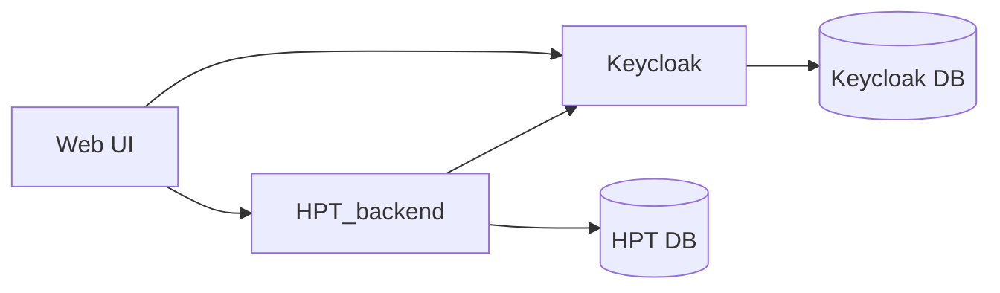

# testcontainers-workshop

<p align="middle">
    
    
</p>    

## "Holiday Planning Tool"

During this workshop we will work with the fictional Holiday Planning Tool.
This is a web application that can be used to schedule your time off work with your colleagues.

Because we all deserve some time off, don't we?


## High level architecture
The architecture of the Holiday Planning Tool, or HPT, is as follows:




```mermaid
gitGraph
    commit id: "Application"
    branch main
    checkout chaos
    merge main
    checkout solution
    merge main
```

The authentication part is implemented by using Keycloak. Keycloak itself uses a PostgreSQL database.
Our own application state is persisted using a separate PostgreSQL database server.

The UI only communicates with the HPT-backend and with Keycloak for the login flow.

